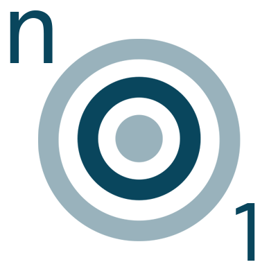

# n01 Oceans and Shelf Seas consortium pages

This is a personal documentation site which will be of some benefit to other
members of the n01, Oceans and Shelf Seas consortium. This site will host more
detailed help and tips on using the codes most frequently employed by members of
the consortium and with associated post-processing tasks.

  - [Consortium Software](models/index.md)
  - [Post-processing tips](postproc/index.md)
  - [Forcing datasets](forcing/index.md)
  - [Personal projects](nemo_studio/index.md)

## Contributing to the documentation

The source for this documentation is publicly available in my [ Github
repository](https://github.com/accowa/n01-pages) so that anyone can contribute
to improve the documentation.  Contributions can be in the form of improvements
or addtions to the content.

## Credits

This documentation builds on the nemo section that was contributed to the
[Official ARCHER2 documentation](https://docs.archer2.ac.uk). That section 
is repeated here under the [Consortium Software](models/index.md) page.

