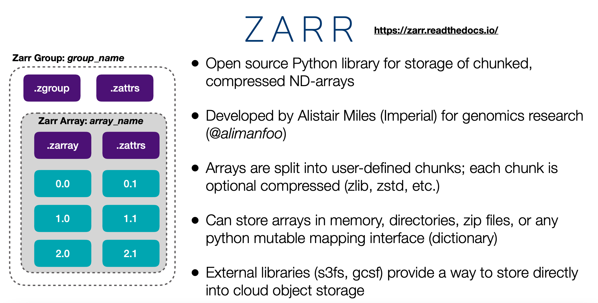

# Using the JASMIN Object store

To quote the JASMIN help pages, the JASMIN object store is:

> High Performance Object Storage (HPOS). This is a new type of storage, and it’s best if
you are working with the cloud. It’s going to be a bit tricky to get the hang of.....

It is also likely to be our main source of new space going forward due to cost and
capacity considerations, so, even without immediate cloud ambitions, we need to get to
grips with it.

A good place to start is:

  - [JASMIN's own page on using the object store](https://help.jasmin.ac.uk/article/4847-using-the-jasmin-object-store)

which explains the technical aspects and how to obtain access. But what does all this mean
from the perspective of a traditional user used to handling ocean model data in a standard
filesystem? The key differences are mentioned on the JASMIN page, namely:

  - An object store is a data storage system that manages data as objects referenced by a
    globally unique identifier, with attached metadata. This is a fundamental change from
    traditional file systems that you may be used to, as there is no directory hierarchy -
    the objects exist in a single flat domain.

  - Data is no longer accessed by mounting a file system onto a host and referencing a
    file path (where authentication is "can I log in to the host"). Instead, the data is
    accessed over HTTP, with authentication using HTTP headers.

So everything is flat, there is no directory hierarchy and no file system to mount or file
paths to search. 'Tricky' indeed when dealing with our usual volumes of data. The JASMIN
page referenced above lists some tools and python packages for accessing data and basic
file system-like manipulations but these suggestions are either: limited in capability
(`s3cmd`) or overly complex for many simple access needs (`Python-Xarray-Dask`).

These pages provide further background information and explain alternative access
capabilities based on familiar tools. Python-based analysis tools based on `Xarray` and
`Dask` are likely to remain the best options for large-scale analysis, but these
alternatives will make one-off and basic tasks more accessible.

## Introduction to ZARR

!!! note
    This information is based on experience during early user testing and
    is subject to change
