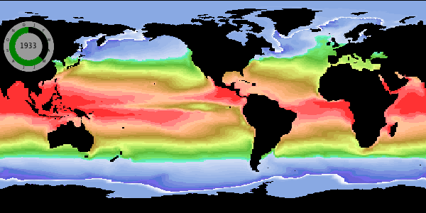

# A first script for producing animation frames on ARCHER2

My NEMO Scriptable Image Maker
([nemosim](https://accowa.github.io/nemosim_manual)) runs on ARCHER2. A typical
image such as:



was produced with this command: 

```
/work/n01/n01/acc/TOOLS/IM/NemoSim/nemosim -d tos -k 1 -bcoord \ 
-bathy  /work/n01/n01/acc/NEMO/eORCA1/eORCA_R1_zps_domcfg.nc \
-usemap /work/n01/n01/acc/TOOLS/IM/NemoSim/eORCA1_600x300.nc \
-limits -1.8 30.0 -r 600 300 -no_offset -sw 0. -90. -ne 360. 90. \
-np 8 -d2 siconc -overlay \
-f  2100/eORCA1_MED_UKESM_y2100m12_grid_T.nc \
-f2 2100/eORCA1_MED_UKESM_y2100m12_icemod.nc \
-o /work/n01/n01/acc/NOCSMULTITASK/frames/out_3011.png -dateclk 35 40 65 15122100
```

which looks daunting but is easily generated in a script and, when run in
parallel on an ARCHER2 node, can produce thousands of frames in mere minutes.
For example:

```
#!/bin/bash
#SBATCH --qos=standard
#SBATCH --job-name=mfra_1m
#SBATCH --time=00:45:00
#SBATCH --nodes=1
#SBATCH --ntasks=12
#SBATCH --ntasks-per-node=12
#SBATCH --cpus-per-task=8
#SBATCH --account=n01
#SBATCH --partition=standard
# Created by: mkslurm -S 0 -s 0 -m 2 -C  12 -c  8 -t 00:10:00 -a n01 -j mcnk_1m
module -s restore /work/n01/shared/acc/n01_modules/ucx_env
export OMP_NUM_THREADS=8
export OMP_PLACES=cores
export CRAY_OMP_CHECK_AFFINITY=TRUE
export PATH=/work/n01/n01/acc/TOOLS/bin:$PATH
export LD_LIBRARY_PATH=/work/n01/n01/acc/TOOLS/lib:/work/n01/n01/acc/TOOLS/IM/lib:$LD_LIBRARY_PATH
#
tskdir=`pwd`
dstdir=`pwd`/frames
dtadir=/work/n01/n01/acc/NEMO/OUT_eORCA1/A005/monthly
ystart=1850
yend=2100
tsklst=$dstdir/tasks.conf
bathyfile=/work/n01/n01/acc/NEMO/eORCA1/eORCA_R1_zps_domcfg.nc
mapfile=/work/n01/n01/acc/TOOLS/IM/NemoSim/eORCA1_600x300.nc
basecmd="/work/n01/n01/acc/TOOLS/IM/NemoSim/nemosim -d tos -k 1 -bcoord -bathy $bathyfile -usemap $mapfile -limits -1.8 30.0 -r 600 300 -no_offset -sw 0. -90. -ne 360. 90. -np $OMP_NUM_THREADS -d2 siconc -overlay "
#
cd $dtadir
#
nf=0
for y in `seq $ystart 1 $yend`
do
 if [ -f $tsklst ] ; then rm $tsklst ; fi
 n=0
 for m in 01 02 03 04 05 06 07 08 09 10 11 12
 do
  for f in `ls -1 ${y}/e*_*y${y}m${m}_grid_T.nc`
  do
    f2=${f/grid_T/icemod}
    if [ -f $f ] && [ -f $f2 ] ; then
     fnf=`printf "%4.4d" $nf`
     ff=${dstdir}/out_${fnf}.png
      echo $n   $basecmd  -f $f -f2 $f2 -o $ff -dateclk 35 40 65 15${m}${y} >> $tsklst
      n=$(( $n + 1 ))
      nf=$(( $nf + 1 ))
    fi
  done
 done
 if [ -f $tsklst ] ; then
  nt=`wc -l $tsklst | sed -e 's/ .*//'`
 else
  nt=0
 fi
 if test $nt -gt 0 ; then
  srun --ntasks=$nt --mem-bind=local --cpu-bind=v,map_cpu:00,0x8,0x10,0x18,0x20,0x28,0x30,0x38,0x40,0x48,0x50,0x58 --multi-prog $tsklst
 fi
done
#
cd $tskdir
```

And for compiling these frames into a mp4 movie:
```
ffmpeg -i frames/out_%04d.png -vcodec mpeg4 -vb 4M eorca1.mp4
```
